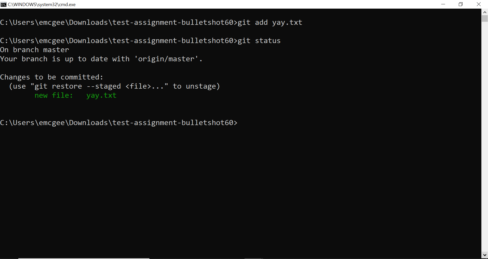
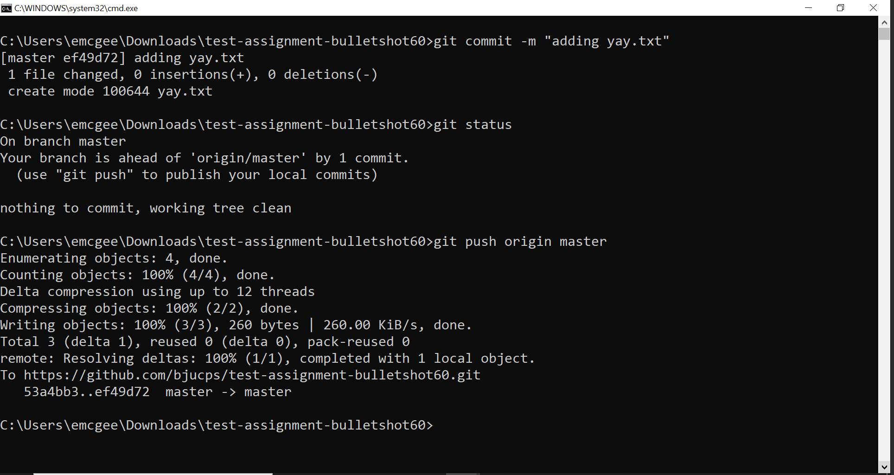

# Instructions for BJU's Git System

* [Setting up for Command Line Submission](#setting-up-for-command-line-submission)
  + [Step 1: Create and Upload Public Key](#step-1-create-and-upload-public-key)
  + [Step 2: Configure Git](#step-2-configure-git)
* [Performing Command Line Submission](#performing-command-line-submission)
  + [Cloning an Assignment Repository](#cloning-an-assignment-repository)
  + [Updating an Assignment Repository](#updating-an-assignment-repository)
  + [Testing an Assignment](#testing-an-assignment)

These instructions describe how to submit assignments from the command line using Git. Because you must generate a private security key, these instructions are intended for use on a personally-owned device. 

Submitting from the command line involves creating a private/public key pair that is used to authenticate you to the BJU Computer Science git submission repository. This key pair is stored in a special folder in your home directory on your computer named .ssh. You must register the public part of the key pair with Jenkins, which allows you to use it to authenticate to our git submission repository.

> Note: The images here were produced on an OS X machine, but the same instructions (unless otherwise noted) also apply to Windows / Linux machines.

## Setting up for Command Line Submission

### Step 1: Create and Upload Public Key

To start, ensure that you have installed the Git Command Line Tools for your operating system, see [here](README-git.md) if you have not yet done so.    

On Windows, open command prompt (for Linux / OS X, open terminal). Execute the  following command to generate a public-private key pair:

```
ssh-keygen -t rsa
```

As shown in the image above, you should press enter at each prompt to accept the defaults (we recommend not setting a passphrase).

> NOTE: If the ssh-keygen command is not installed on your system, see [these instructions](https://docs.microsoft.com/en-us/windows-server/administration/openssh/openssh_install_firstuse) to install it. You do not need to install the OpenSSH server - only the client.


Make a note of the location where your "public key" has been saved (this is the file you will need to upload to Jenkins).

Now login to [Jenkins](https://protect.bju.edu/cps/jenkins/job/git-ssh-key-upload/) with your BJU username / password.

> :warning: NOTE: Make sure that you enter your username in lowercase.  Using capital letters will cause the testing system to not recognize your login attempt and you will be denied access.


Once you have logged into Jenkins with the link above, you should be viewing the "Project Upload SSH Key" page. Click `Build with Parameters`:


Using the `Choose File` button, select the public key file you generated above (id_rsa.pub). Leave the key_tag field empty.


After uploading your key, open a command prompt or terminal and execute the following command:

```
ssh git@csunix.bju.edu info
```

You should get a list of repositories that you have access to.  If not, try executing `ssh-add` then retry the previous command.  If it still doesn't work, seek help!

### Step 2: Configure Git

Configure Git with your BJU username and email address by running the following commands in Command Prompt / Terminal:

```
git config --global user.name "<bju username>"
git config --global user.email "<bju email>"
```

replacing `<bju username>` with your BJU username and `<bju email>` with your BJU email address.

## Performing Command Line Submission

### Cloning an Assignment Repository

To clone an assignment, go to [Submitter](https://protect.bju.edu/cps/submit/upload).


To retrieve the clone URL, use the accordion menu to find the correct class and assignment. Then click the assignment.  The url needed is at the top of the page.


Copy the provided url and in command prompt (or terminal), enter the command 

```
git clone <url>
```


You can now make changes in the folder that has been copied to your local machine.

### Updating an Assignment Repository

After making changes, use the `git status` command to see a list of changes.


To stage files for commiting, use `git add <filename>`.  To remove files, use `git rm <filename>`.



Once you have the files you want to save staged, use `git commit -m "<description of what you did>"` to create a commit.


Then send that commit to Github with `git push origin master`.



You can check in the online repository browser to make sure the file made it to the server correctly.


### Testing an Assignment

To test an assignment, click the `Check Submission` link at the top of the Submitter page.

Once you're at the test page, simply click `Build Now` along the right hand side.


In the build results, if you get a blue dot, you've passed all the provided tests.  Note that you are still advised to create your own tests as the instructor tests are much more thorough than the Jenkins tests.


