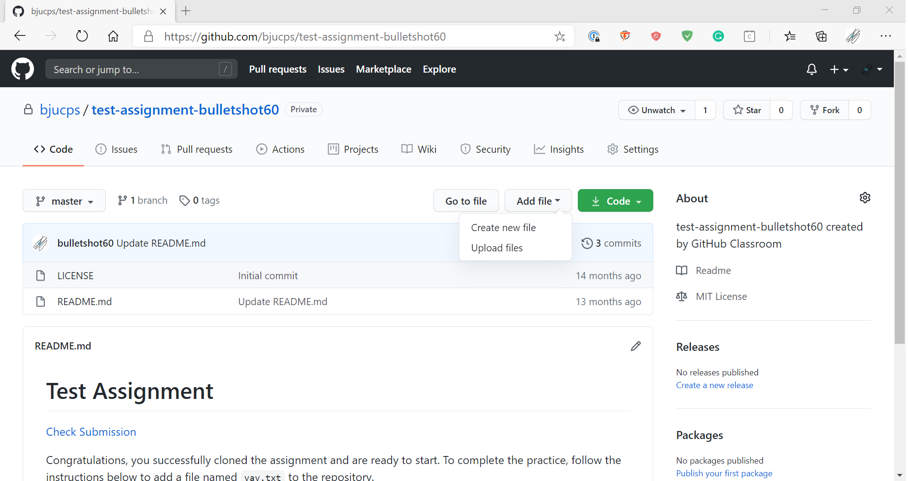

# Instructions for Github Classroom

> Note: The images here were produced on an OS X machine, but the same instructions (unless otherwise noted) also apply to Windows / Linux machines.

### Accessing the Assignment

Click the invitation URL provided to you by your professor.  A sample assignment for you to follow along with is provided [here](https://classroom.github.com/a/iidjEaf-).

If you get an error message, wait a few seconds, then click `Retry Repository Setup`.  If it still fails, contact emcgee@bju.edu.  If everything works, click the URL for your new repository.

### Updating an Assignment Repository

Inside the repository, there are one main button you'll use: `Add File`.  Under this button, you'll find an option for creating a new file as well as uploading files.

> Note: Once a file is uploaded / created, you can edit / rename / delete the file by clicking the file, and then clicking the pencil icon at the top of the page.

### Testing an Assignment

If this is your first time using our testing software, you'll need to authorize the [Communicator application](https://protect.bju.edu/cps/checker/test/test) to access your Github profile (the only information accessed is your Github username).

After you have connected your Github account to your BJU account, click the Actions tab at the top of your repository.  If you have not yet finished the assignment, the top entry will have a red x.  

Click the name of the result (beside the red x), and then click Autograding.  This will display the details of the failure.  Check to make sure your file names are exactly what was specified.

Once you fix the issue, you should get a green check.

