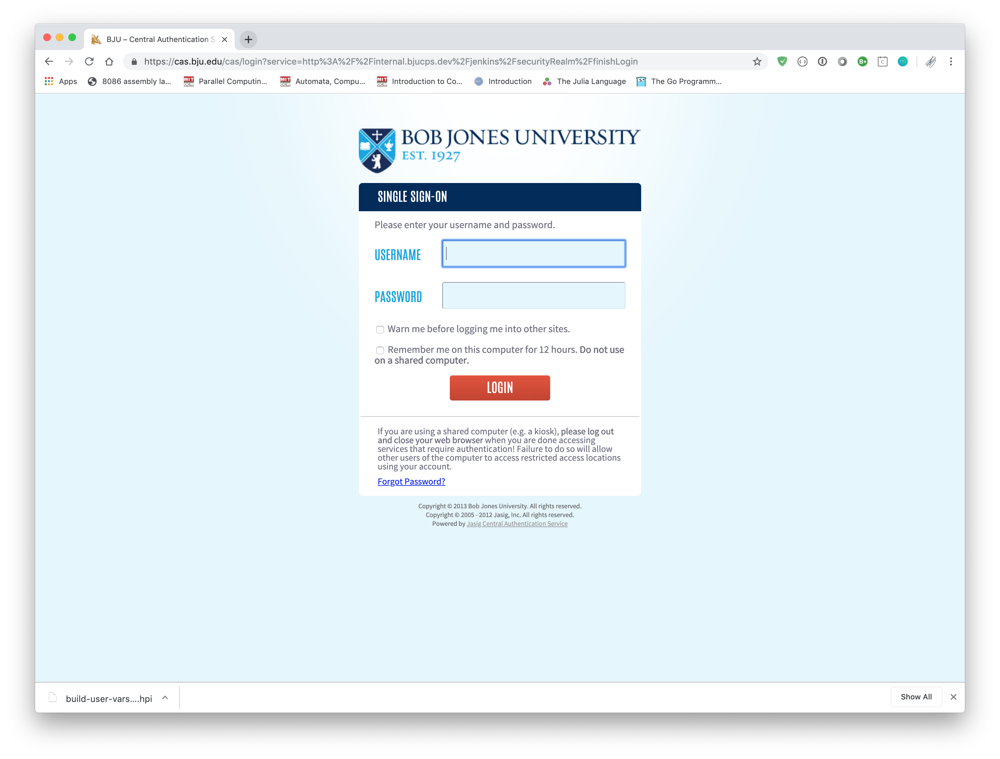
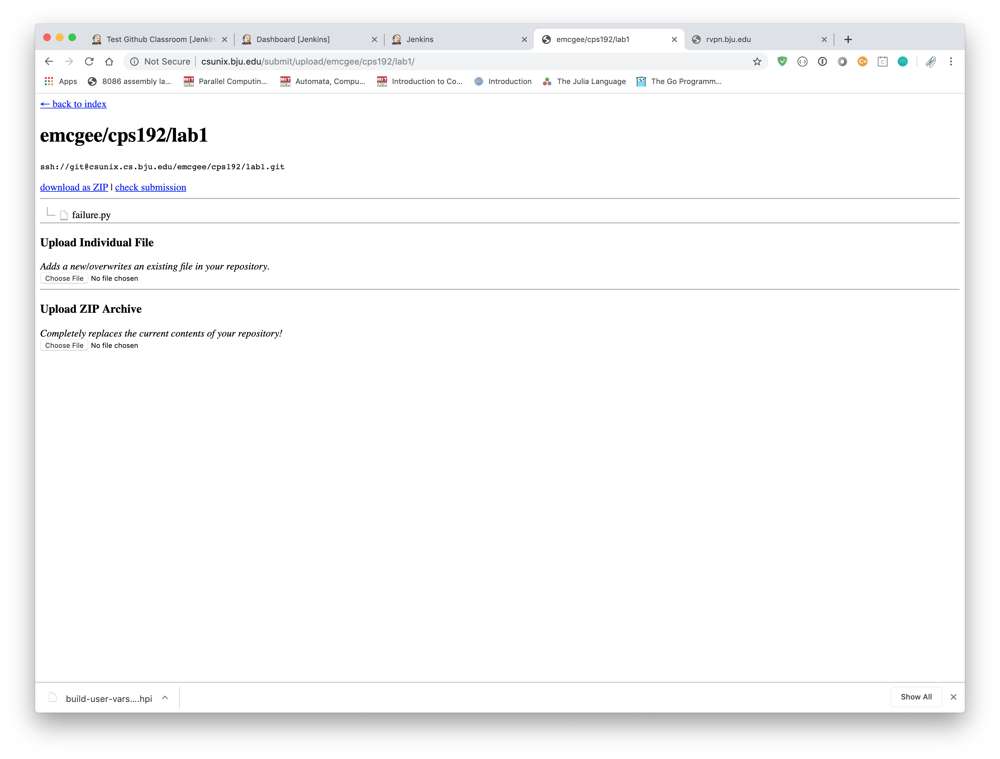
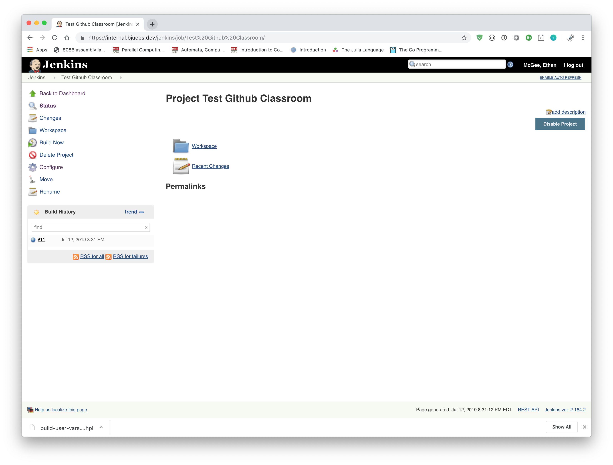

# Instructions for BJU's Git System

> Note: The images here were produced on an OS X machine, but the same instructions (unless otherwise noted) also apply to Windows / Linux machines.

# Sign In to Submiter / Jenkins

Go to [Jenkins](https://protect.bju.edu/cps/jenkins), and you will need to sign into Jenkins with your BJU username / password.

WARNING! Make sure that you enter your username in lowercase.  Using capital letters will cause the testing system to not recognize your login attempt and you will be denied access.

### Submitting

To submit an assignment, go to [Submiter](https://protect.bju.edu/cps/submit/upload).

> Note: Submiter only works on campus or over VPN.  If you are working off-campus, [install the VPN](https://rvpn.bju.edu).  When asked for a portal, the portal is `rvpn.bju.edu`.

Use the accordion menu to find the correct class and assignment. Then click the assignment. 

You can upload as many files as you need by using the `Upload Individual File` option below, or to upload multiple files, create a [Zip archive](https://www.wikihow.com/Make-a-Zip-File) with all your files in it then use the `Upload ZIP Archive` option.

> Note: Once a file is uploaded, you can delete it by right-clicking the file and selecting `Delete`.

### Testing an Assignment

To test an assignment, click the `Check Submission` link at the top of the page.

Once you're at the test page, simply click `Build Now` along the right hand side.

In the build results, if you get a blue dot, you've passed all the provided tests.  Note that you are still advised to create your own tests as the instructor tests are much more thorough than the Jenkins tests.

